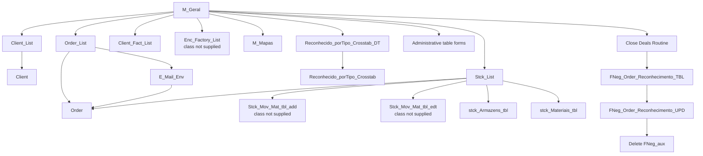

# Access Orders Application — Factual Forms & Workflow Report

**Prepared from the supplied `ORDERS.zip` export**  
**Scope:** confirmed behavior visible in the exported Microsoft Access VBA form class modules and the supplied Access relationships PDF.  
**Database strategy for the replacement:** **the existing database remains in place and will be linked to the new web application. This report does not propose creating or migrating to a new database.**

---

## 1. Evidence reviewed

The supplied package contains:

- **31 Microsoft Access form class modules (`.cls`)**
- **1 PDF** named `orders.pdf`
- The PDF title is **`Relationships for brkr_erp_v15_50_bruker_pt`**
- The PDF is 4 pages; the visible database objects are primarily on pages 1–2.
- The `.cls` files are **VBA code-behind class modules**, not complete Access form-definition exports.

### Important evidence limitation

The `.cls` files establish event handlers, navigation, filtering, validation, action queries, report generation, and some data dependencies. They do **not** establish the complete visual design of each Access form: control positions, labels, colors, tabs, default control properties, all row sources, all record-source properties, and other design metadata are not present.

Likewise, the package references saved queries/views and some forms whose definitions or code are not supplied. Their internal SQL or behavior must not be invented.

Throughout this report:

- **Confirmed** means directly supported by the supplied files.
- **Not established** means the supplied files do not provide enough evidence to state it as fact.
- An apparent inconsistency is described only as an **observed code difference**, not as an assumed bug.

---

# 2. Application overview

The confirmed application is an Access-based operational system centered on:

1. **User validation and permissions**
2. **Clients**
3. **Orders**
4. **Factory / order fulfillment information**
5. **Client invoicing**
6. **Invoice email dispatch**
7. **Revenue recognition**
8. **Stock**
9. **Management reports / Excel exports**
10. **Administrative lookup-table maintenance**
11. **A "close deals" action routine**

The central navigation form is `M_Geral`.

A large part of the operational workflow is order-centric: order list rows open an individual `Order` form, stock/list rows also contain handlers that open an `Order`, invoice-email rows open an `Order`, and the revenue-recognition subform directly reads and writes controls on `Form_Order`.

---

# 3. Supplied form-class inventory

| # | Exported VBA class | Confirmed role from code |
|---:|---|---|
| 1 | `Form_M_Geral.cls` | Main menu, user validation, role state, navigation, admin table launcher, close-deals routine |
| 2 | `Form_Client.cls` | Individual client form code: close, legacy menu action, new record |
| 3 | `Form_Client_List.cls` | Client search/list shell, filtering, insert client |
| 4 | `Form_Client_List_Sub.cls` | Client list row interactions; double-click opens client |
| 5 | `Form_Order_List.cls` | Order search/list shell, filtering, insert order, open email-dispatch module |
| 6 | `Form_Order_List_Sub.cls` | Order list row interactions; double-click opens order |
| 7 | `Form_Client_Fact_List.cls` | Client invoicing/factory-related searchable list |
| 8 | `Form_E_Mail_Env.cls` | Invoice email filtering, Outlook sending, sent-status update |
| 9 | `Form_E_Mail_Env_Sub.cls` | Email/invoice list row interactions; double-click opens order |
| 10 | `Form_Reconhecimento_Sub.cls` | Revenue-recognition editing, totals, backlog calculations, validation and historical-record locking |
| 11 | `Form_Reconhecido_porTipo_Crosstab.cls` | Recognition crosstab lookup/navigation |
| 12 | `Form_Reconhecido_porTipo_Crosstab_DT.cls` | Date-window launcher for recognition crosstab |
| 13 | `Form_Stck_List.cls` | Stock search/list shell and stock maintenance navigation |
| 14 | `Form_Stck_List_Sub.cls` | Exported row-event class containing order-opening double-click handlers |
| 15 | `Form_Stck_Armazens_tbl.cls` | Stock warehouse maintenance form code |
| 16 | `Form_Stck_Materiais_tbl.cls` | Stock material maintenance form code |
| 17 | `Form_M_Mapas.cls` | Reports, filtering, report preview and Excel export |
| 18 | `Form_tbl_Area.cls` | Lookup/master-data maintenance |
| 19 | `Form_tbl_Fact_Status.cls` | Lookup/master-data maintenance |
| 20 | `Form_tbl_Grp_Report.cls` | Lookup/master-data maintenance |
| 21 | `Form_tbl_Identificacao.cls` | Identification maintenance; save/close/legacy action/new |
| 22 | `Form_tbl_Instrumento.cls` | Lookup/master-data maintenance |
| 23 | `Form_tbl_Produto.cls` | Lookup/master-data maintenance |
| 24 | `Form_tbl_Tipo.cls` | Lookup/master-data maintenance |
| 25 | `Form_tbl_Tp_Cliente.cls` | Lookup/master-data maintenance |
| 26 | `Form_tbl_Tp_Doc_FT.cls` | Lookup/master-data maintenance |
| 27 | `Form_tbl_Tp_Order.cls` | Lookup/master-data maintenance |
| 28 | `Form_tbl_Tp_Reconhecimento.cls` | Lookup/master-data maintenance |
| 29 | `Form_tbl_Tp_Revenue.cls` | Lookup/master-data maintenance |
| 30 | `Form_tbl_Tp_Warranty.cls` | Lookup/master-data maintenance |
| 31 | `Form_tbl_Utilizador.cls` | User-maintenance form class; custom VBA only closes form |

---

# 4. Referenced forms not represented by a supplied class module

The supplied VBA directly opens the following forms, but no corresponding class module is present in the ZIP:

- `Order`
- `Enc_Factory_List`
- `Stck_Mov_Mat_tbl_add`
- `Stck_Mov_Mat_tbl_edt`

This does **not** prove the forms are absent from the original Access database. It only means their class code is not present in the supplied export. A form can also exist with little or no code-behind.

The missing `Order` class/definition is especially significant because:

- `Order_List_Sub` opens it by `ID_Order`.
- `E_Mail_Env_Sub` opens it by `ID_Order`.
- `Stck_List_Sub` contains handlers that open it by `ID_Order`.
- `Reconhecimento_Sub` directly accesses controls on `Form_Order`, including:
  - `Sell_Price`
  - `Warranty_Reserve`
  - `S_I_Reconh`
  - `S_W_Reconh`
  - `S_I_BackLog`
  - `S_W_BackLog`

Therefore, the supplied code confirms that the `Order` form is a major runtime dependency, but its complete behavior cannot be documented from this package.

---

# 5. Confirmed high-level navigation



**Source:** `Form_M_Geral.cls`, list/subform classes, stock and email classes.

---

# 6. Authentication and permission workflow

## 6.1 Current Windows identity acquisition

On `M_Geral.Form_Load`:

1. Access creates a `WScript.Network` object.
2. It reads:
   - `Username`
   - `UserDomain`
3. The Windows username is assigned to `Form_M_Geral.ID_User`.
4. The domain is read but is not assigned to an active form field in the supplied code; the relevant assignment is commented out.

The current application therefore bases its user lookup on the Windows username.

## 6.2 User lookup

The main form queries the `Utilizador` data object using `DLookup`.

It reads:

- `Cancelado`
- `User_Name`
- `Read_Only`
- `Admin`

using `ID_User` as the lookup criterion.

## 6.3 Effective role state

The main form maintains two string flags:

- `Editar`
- `Admin`

Confirmed behavior:

### Registered / accepted user

The code enters the registered-user branch when `Cancelado = 0`.

It then:

- displays the database `User_Name`,
- reads `Read_Only`,
- reads `Admin`.

### Read-only user

If `Read_Only = True`:

- `Editar = "N"`

Otherwise:

- `Editar = "S"`

### Administrator

If `Admin = True`:

- `Editar = "S"` regardless of the previous read-only result,
- `Admin = "S"`,
- the controls `Tabelas`, `DT_Fecho`, and `B_FNeg` become visible.

For a non-admin:

- `Admin = "N"`,
- those same admin controls are hidden.

### User outside the accepted branch

The form displays a message saying the user is not registered in the application and will not have an edit profile.

It then sets:

- `Editar = "N"`
- displayed user text to `<ID_User> - Sem edição`

The supplied code does **not** quit the application in this situation; the `DoCmd.Quit` line is commented out.

---

# 7. Permission enforcement visible in the forms

The current Access application does not apply permissions in one uniform way. The following is the behavior actually present in the supplied classes.

| Function | Permission behavior confirmed in code |
|---|---|
| Open client list | Edit if `Editar="S"`, otherwise read-only |
| Add client | Button enabled only if `Editar="S"` |
| Open an existing client from list | Edit if `Editar="S"`, otherwise read-only |
| Open order list | Edit if `Editar="S"`, otherwise read-only |
| Add order | Button enabled only if `Editar="S"` |
| Open existing order from order list | Edit if `Editar="S"`, otherwise read-only |
| Open client invoice list | Edit if `Editar="S"`, otherwise read-only |
| Open factory list | Edit if `Editar="S"`, otherwise read-only |
| Open stock list from main menu | Always opened with `acFormEdit`; no role test in that handler |
| Consult stock movements | Admin gets edit mode; non-admin gets read-only |
| Add stock movement | Opens add form with no role test in that handler |
| Edit warehouses/materials | Opens forms in edit mode with no role test in those handlers |
| Open reports (`M_Mapas`) | Always opened edit mode; no role test in main-menu handler |
| Open recognition crosstab date form | Always edit mode in active code; role-based branch is commented out |
| Admin maintenance selector | Main selector control is visible only for admins |
| Close-deals routine | Button is made visible only for admins in `M_Geral.Form_Load` |

This table documents UI/code behavior only. It does **not** establish what permissions may also exist at the database level.

---

# 8. Main dashboard / menu: `M_Geral`

`M_Geral` is confirmed as the central navigation and permission state form.

## 8.1 Main actions

### Clients

`B_Client_Click` opens `Client_List`.

- Edit mode if `Editar = "S"`
- Read-only otherwise

### Orders

`B_Order_Click` opens `Order_List`.

- Edit mode if `Editar = "S"`
- Read-only otherwise

### Stock

`B_Stck_Alt_Click` opens `Stck_List` in edit mode.

### Reports / Mapas

`Command114_Click` opens `M_Mapas` in edit mode.

### Client invoicing list

`Command122_Click` opens `Client_Fact_List`.

- Edit mode if `Editar = "S"`
- Read-only otherwise

### Recognition by type

`Command123_Click` opens `Reconhecido_porTipo_Crosstab_DT` in edit mode.

A former read-only alternative is present only as commented code.

### Factory list

`Command84_Click` opens `Enc_Factory_List`.

- Edit mode if `Editar = "S"`
- Read-only otherwise

### Exit

`Sair_Click` executes `DoCmd.Quit`.

## 8.2 Form activation

On `Form_Activate`:

- `DoCmd.Restore`
- `Tabelas = 0`

## 8.3 Access Ribbon behavior

On load, the supplied active line is:

- `DoCmd.ShowToolbar "Ribbon", acToolbarYes`

A production line that hides the Ribbon is present but commented out.

---

# 9. Administrative table launcher

The `Tabelas_AfterUpdate` event maps numeric selector values to maintenance forms.

| Selector value | Form opened |
|---:|---|
| 1 | `tbl_Area` |
| 2 | `tbl_Tipo` |
| 3 | `tbl_Produto` |
| 4 | `tbl_Instrumento` |
| 5 | `tbl_Tp_Cliente` |
| 6 | `tbl_Tp_Order` |
| 7 | `tbl_Tp_Revenue` |
| 8 | `tbl_Tp_Warranty` |
| 9 | `tbl_Tp_Reconhecimento` |
| 10 | `tbl_Tp_Doc_FT` |
| 11 | `tbl_Grp_Report` |
| 12 | `tbl_Fact_Status` |
| 98 | `tbl_Utilizador` |
| 99 | `tbl_Identificacao` |

If no recognized selector value is matched, the form shows a message requiring the user to choose an item.

The selector itself is hidden for non-admin users by `M_Geral.Form_Load`.

---

# 10. "Close deals" workflow

The main form contains an admin-visible routine under `B_FNeg_Click`.

Confirmed sequence:

1. Access warnings are disabled.
2. Saved query `FNeg_Order_Reconhecimento_TBL` is opened/executed.
3. Saved query `FNeg_Order_Reconhecimento_UPD` is opened/executed.
4. Table `FNeg_aux` is deleted.
5. Access warnings are re-enabled.
6. A completion message is displayed: the "close deals" routine has finished.

The supplied files do **not** contain the SQL definitions of the two saved queries, so the actual business transformation performed by this routine is not established by the current evidence.

---

# 11. Client workflow

## 11.1 Client list search: `Client_List`

The list uses a base SQL string:

```sql
select * from Client_List
```

Filters are assembled dynamically.

Confirmed filters:

| Form filter | Database/list field | Behavior |
|---|---|---|
| `F_ID` | `ID_Cliente` | exact numeric equality |
| `F_N_PHC` | `no_PHC` | exact equality |
| `F_Cliente` | `Nome` | contains search using `LIKE '*value*'` |
| `F_Contacto` | `contacto` | contains search |
| `F_Tp_Cliente` | `ID_Tp_Cliente` | exact equality |
| `F_Defense` | `Defense` | boolean equality when filter value is below 2 |

The results are loaded into subform `Client_List_Sub`.

## 11.2 Clear/reset behavior

`B_Limpar_Click`:

- clears ID, PHC number, client, contact and type filters,
- sets `F_Defense = 9`,
- sets `Client_List` subform source object to `Client_List_Sub`,
- sets its record source to a query deliberately returning no normal list rows:

```sql
select Client.ID_Cliente from Client_List where ID_Cliente is null
```

- refreshes the form.

## 11.3 Create client

`B_Insert_Click` opens `Client` with `acFormAdd`.

`Form_Current` enables this insert button only when `Form_M_Geral.Editar = "S"`.

## 11.4 Open client from search results

The `Client_List_Sub` class defines double-click handlers on:

- `Check137`
- `codpost`
- `Contacto`
- `fax`
- `ID_Cliente`
- `local`
- `morada`
- `ncont`
- `no_PHC`
- `nome`
- `telefone`
- `Tp_Cliente`
- `zona`

Every supplied handler opens:

```text
Client WHERE ID_Cliente = current row ID_Cliente
```

The form opens:

- in edit mode when `Editar = "S"`,
- read-only otherwise.

## 11.5 Individual client form code

The supplied `Form_Client.cls` contains handlers for:

- close form,
- two legacy Access menu commands,
- go to a new record.

The class does not contain custom validation or calculations.

Because the actual form design export is not supplied, additional control-level behavior defined in properties/macros is not established.

---

# 12. Order list workflow

## 12.1 Order search source

`Order_List.Command45_Click` builds its list from:

```sql
select * from V_Order_List
```

The results are shown in `Order_List_Sub`.

## 12.2 Confirmed order filters

| Form filter | Field | Behavior |
|---|---|---|
| `F_DT_Order_i` | `DT_Order` | date >= start |
| `F_DT_Order_f` | `DT_Order` | date <= end |
| `F_Cliente` | `Nome` | contains search |
| `F_Factory` | `Order_Factory` | boolean when value < 2 |
| `F_Tp_Order` | `ID_Tp_Order` | exact text equality |
| `F_Area` | `ID_Area` | exact text equality |
| `F_Tipo` | `ID_Tipo` | exact text equality |
| `F_Produto` | `ID_Produto` | exact numeric equality |
| `F_Instrumento` | `ID_Instrumento` | exact numeric equality |
| `F_Enc_PHC` | `Encomenda_Cli_PHC` | contains search |
| `F_Neg_Fechado` | `Negocio_Fechado` | boolean when value < 2 |

A former `Orc_Proposta` filter exists only as commented code.

## 12.3 Result ordering

Results are ordered by:

1. `DT_Order DESC`
2. `ID_Order DESC`

## 12.4 Create order

`B_Insert_Click` opens `Order` with `acFormAdd`.

The insert button is enabled only when `Form_M_Geral.Editar = "S"`.

## 12.5 Clear order search

`Command48_Click`:

- clears all active search fields,
- resets factory/closed-business tri-state controls to `9`,
- clears `Order_List.SourceObject`,
- refreshes.

## 12.6 Email module entry

`Command71_Click` opens `E_Mail_Env` in edit mode.

There is no role check in this specific handler.

## 12.7 Open an existing order

`Order_List_Sub` defines double-click handlers on the following displayed/control names:

- `Area`
- `Cod_Enc_Fornecedor`
- `Check217`
- `DT_Order`
- `Encomenda_Cli_PHC`
- `ID_Order`
- `Instrumento`
- `nome`
- `Orc_Proposta`
- `Order_Factory`
- `PO_Cliente`
- `Produto`
- `Sell_Price`
- `Tipo`
- `Tp_Order`
- `Tp_Warranty`
- `Warranty_DT_Inicio`
- `Warranty_Reserve`

Every supplied handler opens `Order` filtered to the row's `ID_Order`.

Mode is:

- edit if `Editar = "S"`,
- read-only otherwise.

---

# 13. Confirmed Order data fields from the relationships PDF

The PDF visibly lists the following fields in `Order`:

- `ID_Order`
- `DT_Order`
- `Order_Factory`
- `ID_Tp_Order`
- `Encomenda_Cli_PHC`
- `ID_Client`
- `ID_Area`
- `ID_Tipo`
- `ID_Produto`
- `ID_Instrumento`
- `Orc_Proposta`
- `PO_Cliente`
- `Sell_Price`
- `ID_Tp_Warranty`
- `Warranty_Reserve`
- `Warranty_DT_Inicio`
- `ID_Tp_Revenue`
- `Facturado`
- `Reconhecido`
- `Cod_Enc_Fornecedor`
- `Obs`
- `Negocio_Fechado`
- `ID_User`
- `DT_User`
- `upsize_ts`
- `Kit`
- `Kit_Amount`
- `Contacto`
- `Email`

The PDF establishes field presence only. The actual data types, required/optional settings, indexes, default values, validation rules, and enforced foreign keys are not safely established by this export.

---

# 14. Factory / fulfillment workflow

## 14.1 Main entry point

`M_Geral.Command84_Click` opens `Enc_Factory_List`.

Role behavior:

- edit for `Editar = "S"`,
- read-only otherwise.

No class module for `Enc_Factory_List` is supplied.

## 14.2 Factory data visible in PDF

`Factory_BK` contains:

- `ID_Factory_BK`
- `ID_Order`
- `Cod_Enc_Factory`
- `Order_Confirmation`
- `Invoice`
- `Ship_DT`
- `Ano`
- `Num`
- `ID_User`
- `DT_User`
- `upsize_ts`
- `Tracking_Number`
- `Weight`
- `Comments`
- `Provider_Invoice`
- `ID_Fact_Status`

This confirms that the data model contains order-linked factory/back-office information including factory order code, confirmation, invoice, shipment date, tracking, weight, comments, provider invoice and status identifier.

The behavior for editing those fields is not established because the referenced factory-list class/definition is not supplied.

---

# 15. Client invoicing / billing list: `Client_Fact_List`

## 15.1 Search source

The active search code starts from:

```sql
select * from V_Facturacao_List
```

Unlike `Client_List` and `Order_List`, the handler sets `Me.RecordSource` directly rather than loading an active subform.

## 15.2 Confirmed filters

| Filter | Field | Behavior |
|---|---|---|
| `F_Enc_PHC` | `Encomenda_Cli_PHC` | contains |
| `F_Enc_Factory` | `Cod_Enc_Factory` | contains |
| `F_Order_Confirmation` | `Order_Confirmation` | contains |
| `F_Invoice` | `Invoice` | contains |
| `F_Ship_DT_i` | `Ship_DT` | >= start |
| `F_Ship_DT_f` | `Ship_DT` | <= end |
| `F_DT_Order_i` | `DT_Order` | >= start |
| `F_DT_Order_f` | `DT_Order` | <= end |
| `F_Area` | `ID_Area` | contains |
| `F_Tipo` | `ID_Tipo` | contains |
| `F_Produto` | `ID_Produto` | exact |
| `F_Cliente` | `Nome` | contains |
| `F_N_Doc_FT` | `N_Doc_FT` | contains |

## 15.3 Observed reset behavior

On clear, the handler clears the filters and assigns:

```text
Me.RecordSource = "V_Enc_Factory_List"
```

This is different from the active search base `V_Facturacao_List`.

The code itself establishes this difference. The supplied files do not establish whether that difference is intentional or accidental.

---

# 16. Invoicing data visible in PDF

The PDF visibly lists `Facturacao` with:

- `ID_Facturacao`
- `ID_Order`
- `DT_Doc_FT`
- `ID_Tp_Doc_FT`
- `N_Doc_FT`
- `Valor_Doc_FT`
- `ID_User`
- `DT_User`
- `upsize_ts`
- `Imprimiu`
- `Imp_Block`
- `Nome_PDF`
- `E_Invoice`

The email code additionally expects its list/query to expose values including:

- client name (`Nome`)
- document type (`Tp_Doc_FT`)
- document number (`N_Doc_FT`)
- customer PO (`PO_Cliente`)
- document date (`DT_Doc_FT`)
- document value (`Valor_Doc_FT`)
- VAT amount (`VAT_Amount`)
- total amount (`Total_Amount`)
- PDF path (`Path`)
- PDF filename (`Nome_PDF`)
- email address (`Email`)

Some of those are not fields in the visible `Facturacao` table and therefore must come from a query/view, joined data, or calculated fields. The current export does not contain the definition of `E_Mail_Env_List`.

---

# 17. Invoice email workflow

The invoice-email workflow is implemented in `Form_E_Mail_Env.cls`.

## 17.1 Search/filter stage

Base list:

```sql
select * from E_Mail_Env_list
```

Confirmed filters:

- invoice/document date start: `DT_Doc_FT >= ...`
- invoice/document date end: `DT_Doc_FT <= ...`
- invoice/document number start: `N_Doc_FT >= ...`
- invoice/document number end: `N_Doc_FT <= ...`

Client and order-type filtering code exists but is commented out.

The assembled WHERE expression is stored in `whr_aux`.

Results are ordered by:

1. `DT_Doc_FT DESC`
2. `N_Doc_FT DESC`

After a successful refresh, the button that marks records as sent is enabled.

Any change to the four active filter controls disables that button until the list is refreshed again.

## 17.2 Sending stage

When `B_Env_Email_Click` runs:

1. A DAO database object is opened with `CurrentDb`.
2. A DAO recordset is opened against `E_Mail_Env_List`.
3. The recordset is filtered by `whr_aux` if a filter exists.
4. If no rows exist, the user is told there are no invoices to send.
5. Otherwise the code loops through the recordset.
6. For each loop iteration it:
   - creates `Outlook.Application`,
   - creates a mail item,
   - sends on behalf of `brukerportugal@bruker.com`,
   - uses `rs!Email` as the recipient,
   - requests a read receipt,
   - sets a generated subject,
   - sets a generated plain-text body,
   - checks whether the PDF attachment exists,
   - attaches it if present,
   - still sends the email if the attachment is absent, while recording that condition in a log,
   - sends the item.

After the loop, it creates another Outlook message addressed to the group sender address and sends a process log.

## 17.3 Email content source

The code builds subject/body variables containing:

- client name
- document type
- document number
- customer PO
- document date
- value excluding VAT
- VAT value
- total value
- a hard-coded company/signature block
- an automatic-message notice

## 17.4 Attachment path

The code constructs an attachment path using:

```text
Me.Path & "\" & Me.Nome_PDF
```

and checks it with `Dir(...)`.

## 17.5 Error handling

The supplied handler explicitly treats:

- error `287` as user cancellation,
- error `-2147467259` as a send/address-type error path,
- all other errors via a generic error message.

For the `-2147467259` branch it records the affected client/document in an error-address log and resumes with the next operation.

## 17.6 Mark invoices as sent

`B_Enviado_email_upd_Click` runs an update against `Facturacao`.

Without a filter it updates records matching:

- `Imprimiu = False`
- `Imp_Block = False OR Imp_Block IS NULL`

With a filter it adds the stored `whr_aux` expression.

The update sets:

```text
Facturacao.Imprimiu = True
```

After the update:

- warnings are restored,
- the "mark sent" button is disabled,
- the filters/list are cleared,
- a message says the invoicing has been marked as sent.

Therefore, in this workflow, the field named `Imprimiu` is actively used by the code when marking invoices as sent.

---

# 18. Observed email implementation details that must be understood before reproducing behavior

The following are direct observations from the supplied code.

## 18.1 A debug message exists

The send routine contains:

```vb
MsgBox "tst"
```

immediately after the recordset is opened.

## 18.2 Several email values are read from form controls before the recordset loop

Before `Do While Not rs.EOF`, the code assigns:

- `v_Cliente = Me.Nome`
- `v_Tp_Doc = Me.Tp_Doc_FT`
- `v_N_Doc = Me.N_Doc_FT`
- `v_PO = Me.PO_Cliente`
- date/value variables from the current form
- the PDF path from current form controls

Inside the loop, the recipient uses `rs!Email`, but those subject/body/attachment variables are not reassigned from the recordset in the supplied code.

This is a confirmed implementation detail. The intended multi-row semantics are not documented in the package.

## 18.3 Sent-email counter is not incremented in the supplied normal loop

`v_CountEmail` is initialized to `0`.

There is no normal-loop statement in the supplied class that increments it.

The error-address branch decrements it by one.

Therefore the numerical "emails sent" value in the final log is not maintained by an increment in the provided implementation.

---

# 19. Email-list row navigation

`E_Mail_Env_Sub` defines double-click handlers on:

- `Check373`
- `Contacto`
- `DT_Doc_FT`
- `Email`
- `Encomenda_Cli_PHC`
- `ID_Order`
- `N_Doc_FT`
- `Nome_PDF`
- `Text267`
- `Text269`
- `Total_Amount`
- `Tp_Doc_FT`
- `Valor_Doc_FT`
- `VAT_Amount`

Every supplied handler opens the `Order` form for the current `ID_Order`.

Mode is:

- edit when `Editar = "S"`,
- read-only otherwise.

---

# 20. Revenue-recognition workflow

The most explicit business-rule code in the supplied form classes is in `Form_Reconhecimento_Sub.cls`.

The recognition data object used by the code is `Reconhecimento`.

The code distinguishes:

- recognition type `W`
- all recognition types other than `W`

Within the existing business logic, `W` is treated as the warranty side of recognition and non-`W` records as the instrument/non-warranty side.

## 20.1 Confirmed recognition table fields

The PDF shows:

- `ID_Reconhecimento`
- `ID_Order`
- `ID_Tp_Reconhecimento`
- `DT_Reconhecimento`
- `Valor_Reconhecimento`
- `ID_User`
- `DT_User`
- `upsize_ts`

## 20.2 Totals written back to the open Order form

The subform calculates:

```text
S_I_Reconh =
    sum(Valor_Reconhecimento)
    for same ID_Order
    where ID_Tp_Reconhecimento <> "W"
```

and:

```text
S_W_Reconh =
    sum(Valor_Reconhecimento)
    for same ID_Order
    where ID_Tp_Reconhecimento = "W"
```

Those values are assigned to controls on `Form_Order`.

## 20.3 Instrument recognition limit

The effective instrument/non-warranty capacity is calculated as:

```text
Sell_Price - Warranty_Reserve
```

The code warns if total non-`W` recognition exceeds that amount.

## 20.4 Warranty recognition limit

The warranty capacity is:

```text
Warranty_Reserve
```

The code warns if total `W` recognition exceeds that amount.

## 20.5 Backlog values in date/type/value update handlers

For the active update handlers, the code calculates:

```text
S_I_BackLog =
    (Sell_Price - Warranty_Reserve)
    - sum(non-W recognition dated <= today)
```

and:

```text
S_W_BackLog =
    Warranty_Reserve
    - sum(W recognition dated <= today)
```

These are assigned to `Form_Order.S_I_BackLog` and `Form_Order.S_W_BackLog`.

## 20.6 Validation when recognition value changes

After `Valor_Reconhecimento` is updated:

- totals and backlog are recalculated,
- if non-`W` total recognition exceeds `Sell_Price - Warranty_Reserve`:
  - a critical message is shown,
  - the entered `Valor_Reconhecimento` is set to `Null`,
  - focus moves to the recognition date,
  - totals are refreshed.
- if `W` total recognition exceeds `Warranty_Reserve`:
  - analogous behavior occurs.

The message also calculates/displays a remaining/difference value.

## 20.7 Historical recognition locking

When the date/type/value controls receive focus, the code checks:

```text
DT_Reconhecimento < Date
```

For a date before today:

- `ID_Tp_Reconhecimento.Locked = True`
- `DT_Reconhecimento.Locked = True`
- `Valor_Reconhecimento.Locked = True`

For today or a future date, those controls are unlocked.

## 20.8 Explicit historical-edit warning

Double-click handlers for:

- recognition date,
- recognition type,
- recognition value

check whether the recognition date is before today.

If so they show:

> "Vai editar um reconhecimento de data anterior a hoje!!"

and explicitly unlock the double-clicked control.

## 20.9 Recalculation after deletion

`Form_AfterDelConfirm` recalculates the total recognized instrument/warranty values.

However, its assignments to the two `BackLog` controls are calculated differently from the date/type/value update handlers:

```text
v_SIB = sum(non-W recognition where date > today)
v_SWB = sum(W recognition where date > today)
```

Those sums are then assigned to:

- `S_I_BackLog`
- `S_W_BackLog`

This difference is present in the supplied code. Whether it is intentional is not established.

---

# 21. Recognition-by-type crosstab workflow

## 21.1 Date launcher

`Reconhecido_porTipo_Crosstab_DT.Form_Current` initializes:

- `Data_Inicial = 01/01/<current year>`
- `Data_Final = 31/12/<current year>`

A button opens `Reconhecido_porTipo_Crosstab` in edit mode.

The date form can also close itself.

The supplied VBA does not show the crosstab query definition, so it does not establish exactly how `Data_Inicial` and `Data_Final` are consumed.

## 21.2 Crosstab form

Confirmed behavior:

- `comboFact_AfterUpdate` counts rows in `Reconhecido_porTipo_Crosstab` matching the entered `ID_Order`.
- If no record exists, it shows a "document not found" message.
- Otherwise it focuses `ID_Order` and executes `DoCmd.FindRecord`.
- `Combo266_Change` applies the literal filter `ID_Order = 1`.
- On load, the form closes `Reconhecido_porTipo_Crosstab_DT`.
- On close, it again closes `Reconhecido_porTipo_Crosstab_DT`.

---

# 22. Stock workflow

## 22.1 Stock list source

`Stck_List.B_AtualizarF_Click` queries:

```sql
select * from dbo_V_stck_Group
```

Confirmed filters:

| Filter | Field | Behavior |
|---|---|---|
| `F_ref` | `ref` | contains |
| `F_desc` | `description` | contains |
| `F_arm` | `id_arm` | exact equality |

Results are loaded into subform `Stck_List_Sub`.

## 22.2 Clear stock search

`B_LimparF_Click`:

- clears warehouse, description and reference filters,
- clears the stock subform source object.

## 22.3 Stock movement consultation

`B_Cons_Mov_Click` opens `Stck_Mov_Mat_tbl_edt`.

- Admin: edit mode
- Non-admin: read-only

## 22.4 Add movement

`B_Inserir_Mov_Click` opens `Stck_Mov_Mat_tbl_add` with `acFormAdd`.

There is no role check in that handler.

## 22.5 Warehouse/material maintenance

Buttons open:

- `stck_Armazens_tbl`
- `stck_Materiais_tbl`

both in edit mode.

No role check is present in those handlers.

## 22.6 Additional exported handler

`Command46_Click` sets:

```text
stDocName = "Clientes"
```

and attempts to open that form in add mode.

No exported class named `Clientes` is supplied. The active client form used elsewhere is named `Client`.

This is a direct code observation; the intended purpose of this handler is not established.

## 22.7 `Stck_List_Sub` exported code

The supplied `Form_Stck_List_Sub.cls` contains the same set of 18 order-oriented double-click handlers as `Order_List_Sub`, including controls such as:

- `DT_Order`
- `Encomenda_Cli_PHC`
- `Sell_Price`
- `Warranty_Reserve`
- `Produto`
- `Instrumento`

Every handler opens `Order` by `ID_Order`, using edit/read-only mode based on `Editar`.

The supplied form-design metadata is absent, so it is not established whether every one of those handlers corresponds to a currently visible stock-list control or whether some code is inherited/copied/stale.

---

# 23. Reports / "Mapas" workflow

The report hub is `M_Mapas`.

It supports two output modes:

- Access report preview
- Excel export

## 23.1 Output-mode toggle

`B_Excel` and `B_Relatorio` are made mutually exclusive by their click handlers.

On `Form_Current`:

- `B_Relatorio = True`
- `B_Excel = False`

Therefore report preview is the default mode in the supplied code.

## 23.2 Date requirement

Before generating a report, `Command175_Click` requires that at least one of:

- `F_DT_i`
- `F_DT_f`

is populated.

If both are null, generation stops with a message requiring dates.

The backlog report (`F_Mapa = 85`) adds a stricter requirement: `F_DT_f` must be populated.

## 23.3 Available report filters

The report form builds filters for:

- start date
- end date
- `Area`
- `Tipo`
- `Produto`
- `Tp_Cliente`
- `Tp_Revenue`

For display text, it resolves descriptive values using `DLookup` against:

- `Area`
- `Tipo`
- `Produto`
- `Tp_Cliente`
- `Tp_Revenue`

The human-readable filter description is stored in `Filtro_Desc`.

## 23.4 Product dependency

When `F_Area` changes:

- `F_Produto.Requery` is executed.

This confirms that the product choice is intended to react to the selected area at the form level.

## 23.5 Report-specific filter availability

For `F_Mapa = 1`:

- product is disabled/cleared,
- customer type is disabled/cleared,
- revenue type is disabled/cleared.

For `F_Mapa = 2`:

- customer type is disabled/cleared,
- revenue type is disabled/cleared.

Other mapped report IDs leave those controls enabled in the supplied logic.

## 23.6 Temporary export query

Before report generation, the code looks for a QueryDef named `qry_EXP` and deletes it if present.

For Excel outputs it commonly:

1. creates `qry_EXP` with dynamically generated SQL,
2. outputs `qry_EXP` as `.xls`,
3. deletes `qry_EXP`.

---

# 24. Confirmed report IDs and behavior

## 24.1 `F_Mapa = 1` — Production by Area and Type

Title default:

```text
Produção por Área e Tipo
```

Report name:

```text
Producao_AT
```

Before output, the routine:

1. deletes all rows from `Producao_rpt`,
2. runs:
   - `rpt_Producao_BL_i`
   - `rpt_Producao_BL_i_warranty`
   - `rpt_Producao_BL_f`
   - `rpt_Producao_BL_f_warranty`
   - `rpt_Producao_NOB`
   - `rpt_Producao_NOB_Warranty`
   - `rpt_Producao_Revenue`
   - `rpt_Producao_Revenue_warranty`

Its data selection is based on `rpt_Producao_AT`.

Output:

- Access report preview `Producao_AT`, or
- `.xls` from a temporary `qry_EXP`.

## 24.2 `F_Mapa = 2` — Production by Area, Type and Product

Title default:

```text
Produção por Área, Tipo e Produto
```

Report name:

```text
Producao_ATP
```

It performs the same `Producao_rpt` clear and eight query executions as report 1.

Its data selection is based on `rpt_Producao_ATP`.

Output:

- Access report preview `Producao_ATP`, or
- `.xls`.

## 24.3 `F_Mapa = 81` — NOB

Title default:

```text
Report - NOB
```

Report:

```text
R_NOB
```

Before output:

1. deletes all rows from `rpt_R_NOB`,
2. runs:
   - `rpt_R_NOB_sem_warranty`
   - `rpt_R_NOB_warranty`

The dynamic aggregate query groups by:

- `DT_AM`
- month (`Mes`)
- `Area`
- `Grp_Report`
- `Produto`

and sums:

- `Sell_Price`

Output:

- report preview `R_NOB`, or
- Excel generated from the dynamic aggregate query.

## 24.4 `F_Mapa = 82` — NOB by Geographic Region

Title default:

```text
Report - NOB by Geogr Region
```

Report:

```text
R_NOB_Geog
```

It repopulates `rpt_R_NOB` using the same two warranty/non-warranty queries.

Report selection uses `rpt_R_NOB`.

The Excel projection includes:

- `Area & '-' & Produto` as `Nature_of_NOB`
- `Tp_Revenue` as `Type_of_NOB`
- constant country code `PT-Portugal`
- constant country `Portugal`
- first day of recognition/NOB month as `Date_NOB`
- `Sell_Price`
- `ID_Tipo`
- `GRP_Report`

## 24.5 `F_Mapa = 83` — Revenue

Title default:

```text
Report - Revenue
```

Report:

```text
R_Revenue
```

The dynamic query reads `rpt_R_Revenue`, groups by:

- `DT_AM`
- `Mes`
- `Area`
- `Grp_Report`
- `Produto`

and sums:

- `Valor_Reconhecimento` as `REVENUE`

Output:

- report preview `R_Revenue`, or
- Excel from dynamic query.

## 24.6 `F_Mapa = 84` — Revenue by Geographic Region

Title default:

```text
Report - Revenue by Geogr Region
```

Report:

```text
R_Revenue_Geog
```

The report data reads `rpt_R_Revenue`.

The Excel projection includes:

- `Tp_Cliente` as `Customer_Type`
- `Area & '-' & Produto` as `Nature_of_Sale`
- `Tp_Revenue` as `Type_of_Revenue`
- customer name
- constant country code/country
- `Defense` mapped to `Yes` or `No`
- first day of month as `Date_Revenue`
- constant currency `Eur`
- `Valor_Reconhecimento` as `Revenue`

## 24.7 `F_Mapa = 85` — Backlog

Title default:

```text
Report - Backlog
```

Report:

```text
R_Backlog
```

Additional rule:

- `F_DT_f` is mandatory.

Before output:

1. deletes all rows from `Producao_rpt`,
2. runs:
   - `rpt_Producao_BL_f`
   - `rpt_Producao_BL_f_warranty`
   - `rpt_R_Backlog_Ship`

Report data is read from `rpt_R_Backlog`.

The Excel output includes fields/constants such as:

- Country
- customer name
- customer type
- customer SAP placeholder
- order date
- NOB
- SAP order placeholder
- division / area
- type
- product line
- backlog
- delivery/estimate placeholder columns
- production
- shipment

### Observed difference between the two backlog Excel branches

When no non-date report filter is present, the projection includes:

```text
Encomenda_Cli_PHC as Order_Number
```

In the filtered branch, that `Order_Number` projection is absent.

That difference is present in the supplied source; intent is not established.

---

# 25. Report title prompt

For the mapped reports, the code prompts the user through `InputBox` to define the report title, showing the current filter description.

The chosen title is stored in `Titulo_Mapa`.

For production Excel exports, the chosen title is used as the `.xls` filename.

---

# 26. Administrative maintenance-form behavior

The following classes share a minimal pattern:

- `tbl_Area`
- `tbl_Fact_Status`
- `tbl_Grp_Report`
- `tbl_Instrumento`
- `tbl_Produto`
- `tbl_Tipo`
- `tbl_Tp_Cliente`
- `tbl_Tp_Doc_FT`
- `tbl_Tp_Order`
- `tbl_Tp_Reconhecimento`
- `tbl_Tp_Revenue`
- `tbl_Tp_Warranty`
- `Stck_Armazens_tbl`
- `Stck_Materiais_tbl`

Each supplied class contains:

1. a close-form handler,
2. another handler that invokes two legacy `DoCmd.DoMenuItem` commands.

The exact user-facing meaning of those legacy menu command numbers is not described in the source itself, so this report does not assign a business meaning to them.

## `tbl_Identificacao`

Its class additionally contains:

- explicit `acSaveRecord`,
- close,
- the legacy two-command action,
- `GoToRecord ... acNewRec`.

## `tbl_Utilizador`

The supplied custom class contains only a close handler.

This does not establish the fields/layout of the user-maintenance form because those are form-definition properties, not included in the `.cls`.

---

# 27. Database objects visibly listed in the relationships PDF

The supplied PDF visibly contains the following data objects.

## 27.1 `Area`

- `ID_Area`
- `Area`
- `Area_Cod`
- `ID_User`
- `DT_User`
- `upsize_ts`

## 27.2 `Produto`

- `ID_Produto`
- `ID_Area`
- `Produto`
- `Produto_Cod`
- `ID_User`
- `DT_User`
- `upsize_ts`

## 27.3 `Instrumento`

- `ID_Instrumento`
- `ID_Produto`
- `Instrumento`
- `ID_User`
- `DT_User`
- `upsize_ts`

## 27.4 `Tp_Revenue`

- `ID_Tp_Revenue`
- `Tp_Revenue`
- `ID_User`
- `DT_User`
- `upsize_ts`

## 27.5 `Order`

Fields listed earlier in section 13.

## 27.6 `Tp_Order`

- `ID_Tp_Order`
- `Tp_Order`
- `Provisoria`
- `ID_User`
- `DT_User`
- `upsize_ts`

## 27.7 `Client`

- `ID_Cliente`
- `no_PHC`
- `ID_Tp_Cliente`
- `nome`
- `ncont`
- `fax`
- `telefone`
- `contacto`
- `morada`
- `local`
- `codpost`
- `zona`
- `Defense`
- `upsize_ts`

## 27.8 `Facturacao`

Fields listed earlier in section 16.

## 27.9 `Reconhecimento`

Fields listed earlier in section 20.

## 27.10 `Tipo`

- `ID_Tipo`
- `Tipo`
- `Tipo_Cod`
- `Warranty`
- `ID_Grp_Report`
- `ID_User`
- `DT_User`
- `upsize_ts`

## 27.11 `Grp_Report`

- `ID_Grp_Report`
- `Grp_Report`
- `upsize_ts`

## 27.12 `Tp_Warranty`

- `ID_Tp_Warranty`
- `Tp_Warranty`
- `N_Anos`
- `Reserve_Ano_p`
- `ID_User`
- `DT_User`
- `upsize_ts`

## 27.13 `Factory_BK`

Fields listed earlier in section 14.

## 27.14 `Tp_Doc_FT`

- `ID_Tp_Doc_FT`
- `Tp_Doc_FT`
- `ID_User`
- `DT_User`
- `upsize_ts`

## 27.15 `Tp_Reconhecimento`

- `ID_Tp_Reconhecimento`
- `Tp_Reconhecimento`
- `ID_User`
- `DT_User`
- `upsize_ts`

## 27.16 `Tp_Cliente`

- `ID_Tp_Cliente`
- `Tp_Cliente`
- `ID_User`
- `DT_User`
- `upsize_ts`

---

# 28. Relationship facts versus relationship assumptions

The PDF is titled as an Access relationships export and places related-looking tables together. However, the supplied render does not provide a sufficiently clear set of connector lines/cardinality markers to document every enforced foreign-key relationship as fact.

The following can be stated directly from field names and code usage:

- `Reconhecimento` contains `ID_Order`, and recognition calculations explicitly filter it by the current order's `ID_Order`.
- `Facturacao` contains `ID_Order`.
- `Factory_BK` contains `ID_Order`.
- `Order` contains:
  - `ID_Client`
  - `ID_Area`
  - `ID_Tipo`
  - `ID_Produto`
  - `ID_Instrumento`
  - `ID_Tp_Order`
  - `ID_Tp_Warranty`
  - `ID_Tp_Revenue`
- `Produto` contains `ID_Area`.
- `Instrumento` contains `ID_Produto`.
- `Tipo` contains `ID_Grp_Report`.

These fields clearly provide the identifiers used for associations in the application model, but this report does not claim referential-integrity enforcement or cardinality without the original database metadata.

---

# 29. Saved queries, views and data objects referenced by the VBA

These are dependencies that the replacement application must understand or continue to consume.

## 29.1 Client/order/list sources

- `Client_List`
- `V_Order_List`
- `V_Facturacao_List`
- `V_Enc_Factory_List`
- `E_Mail_Env_List`
- `dbo_V_stck_Group`
- `Reconhecido_porTipo_Crosstab`

## 29.2 Close-deals routine

- `FNeg_Order_Reconhecimento_TBL`
- `FNeg_Order_Reconhecimento_UPD`
- temporary/auxiliary table `FNeg_aux`

## 29.3 Production report objects

- `Producao_rpt`
- `rpt_Producao_BL_i`
- `rpt_Producao_BL_i_warranty`
- `rpt_Producao_BL_f`
- `rpt_Producao_BL_f_warranty`
- `rpt_Producao_NOB`
- `rpt_Producao_NOB_Warranty`
- `rpt_Producao_Revenue`
- `rpt_Producao_Revenue_warranty`
- `rpt_Producao_AT`
- `rpt_Producao_ATP`

## 29.4 NOB / Revenue / Backlog report objects

- `rpt_R_NOB`
- `rpt_R_NOB_sem_warranty`
- `rpt_R_NOB_warranty`
- `rpt_R_Revenue`
- `rpt_R_Backlog`
- `rpt_R_Backlog_Ship`

## 29.5 Dynamic temporary query

- `qry_EXP`

The SQL definitions of the saved queries/views above are not included in the supplied package unless SQL is explicitly constructed inside `M_Mapas`. Their full logic is therefore not established here.

---

# 30. Confirmed business vocabulary and concepts

The supplied source establishes the following business concepts as first-class fields, filters, tables, or reports:

- Area
- Type (`Tipo`)
- Product
- Instrument
- Customer type
- Order type
- Revenue type
- Warranty type
- Recognition type
- Invoice/document type
- Report group
- Facturation status
- Customer PHC number
- Customer PHC order
- Customer PO
- Supplier order code
- Factory order
- Factory confirmation
- Factory invoice
- Provider invoice
- Shipment date
- Tracking number
- Weight
- Sell price
- Warranty reserve
- Warranty start date
- Revenue recognition
- Instrument/non-warranty recognition
- Warranty recognition
- Backlog
- NOB
- Revenue
- Production
- Closed deal (`Negocio_Fechado`)
- Defense customer flag
- PDF invoice filename
- Electronic invoice flag (`E_Invoice`)
- Sent/printed state via `Imprimiu`
- Send/print blocking via `Imp_Block`

The report intentionally preserves the original field terminology where possible.

---

# 31. Confirmed workflow requirements for the replacement web platform

Because the database will remain linked rather than be replaced, the new application must preserve the following externally observable behavior if functional equivalence is the goal.

## 31.1 User/session requirements

- identify a user,
- map the user to the existing `Utilizador` rules or an agreed equivalent,
- distinguish edit/read-only behavior,
- distinguish admin behavior,
- expose admin-only maintenance/close-deal actions accordingly.

The browser replacement cannot literally execute the existing `WScript.Network` VBA code; however, the factual requirement being replaced is **identifying the user and resolving the same permission state**.

## 31.2 Client requirements

- search by the confirmed client filters,
- clear/reset search,
- create a client for users with edit permission,
- open existing client detail,
- respect edit/read-only mode.

## 31.3 Order requirements

- search by the confirmed order filters,
- order results by date and ID descending,
- clear/reset search,
- create an order for users with edit permission,
- open order detail by `ID_Order`,
- preserve edit/read-only behavior,
- provide a path from orders to invoice-email workflow.

## 31.4 Recognition requirements

- display/maintain recognition records by order,
- separate `W` and non-`W` recognition,
- recalculate recognized totals,
- recalculate the current backlog values according to the confirmed code,
- prevent/undo an entered recognition amount that exceeds its applicable capacity,
- treat historical recognition edits differently from current/future records,
- preserve the visible warning behavior or an agreed equivalent.

## 31.5 Invoicing/email requirements

- filter the invoice-email candidate list,
- open related order details,
- send invoice email(s) to customer addresses,
- attach PDF where available,
- surface/log attachment failures,
- surface/log email-address/send errors,
- send or record a process log,
- mark the selected eligible `Facturacao` rows by setting `Imprimiu=True` according to the confirmed update conditions.

## 31.6 Stock requirements

- filter stock by reference, description and warehouse ID,
- open stock movement consultation,
- create stock movements,
- maintain warehouses/materials where permitted,
- preserve the existing link from the exported stock row handlers to order detail if that behavior is confirmed as active in the final Access form definition.

## 31.7 Reporting requirements

The replacement must be able to reproduce or intentionally replace the outputs of:

- Production by Area and Type
- Production by Area, Type and Product
- NOB
- NOB by Geographic Region
- Revenue
- Revenue by Geographic Region
- Backlog

with the confirmed filters and date rules.

The current application supports both:

- report preview,
- Excel `.xls` export.

## 31.8 Administrative requirements

Admin users need access to the confirmed master/lookup maintenance areas listed in section 9.

---

# 32. Confirmed implementation differences / anomalies that should not be silently copied

These are not assumptions. They are places where two parts of the supplied source differ or where an implementation detail is visibly unusual.

| Area | Confirmed source observation |
|---|---|
| Client invoice list clear | Search uses `V_Facturacao_List`; clear assigns `V_Enc_Factory_List` |
| Recognition backlog after delete | After delete, backlog controls receive sums of future recognition; other update handlers use capacity minus recognition through today |
| Email multi-row send | Recipient is read from each recordset row, while subject/body/document variables are assigned from form controls before the loop |
| Email count | `v_CountEmail` is initialized but not incremented in the normal send loop |
| Email debug | `MsgBox "tst"` remains in the active send routine |
| Backlog Excel | Filtered and unfiltered SQL projections differ; the filtered branch omits `Order_Number` |
| Stock permissions | Main stock form, add movement and warehouse/material maintenance handlers do not perform the same role checks as movement consultation |
| Recognition crosstab permission | Permission-based code is commented out; active code opens in edit mode |
| Stock subform code | Exported `Stck_List_Sub` contains the same order-opening handlers as `Order_List_Sub` |
| Stock add-client handler | `Command46` attempts to open form `Clientes`, while the supplied client form is `Client` |
| Ribbon | Active code shows the Access Ribbon; the production-hide line is commented |
| Close-deals warnings | Warnings are disabled while queries execute and the auxiliary table is deleted; no local error handler is present in that routine |

Before conversion, each of these should be classified as one of:

- behavior to preserve,
- obsolete code,
- defect to correct,
- artifact of the old Access UI.

That classification cannot be made solely from the supplied files.

---

# 33. What is not established by the current package

The following must **not** be treated as known facts yet.

## 33.1 Complete Order form behavior

Not supplied:

- complete `Order` form definition,
- full control list/layout,
- code-behind for the `Order` form,
- all subforms used on it,
- all validations triggered by its own controls.

## 33.2 Factory list behavior

`Enc_Factory_List` is referenced but its class/definition is not supplied.

## 33.3 Stock movement form behavior

No supplied class for:

- `Stck_Mov_Mat_tbl_add`
- `Stck_Mov_Mat_tbl_edt`

## 33.4 SQL definitions of saved queries/views

Not included for most named queries/views.

Without those definitions, this report cannot state the full formulas behind:

- close deals,
- production report staging,
- NOB staging,
- revenue report source,
- backlog source,
- client/order list joins,
- invoice-email list joins,
- factory list joins,
- stock view.

## 33.5 Complete form UI

The `.cls` export does not provide a reliable visual specification of each Access form.

## 33.6 Database data types and constraints

The PDF does not provide enough evidence for:

- exact data types,
- nullability,
- primary-key declarations,
- foreign-key enforcement,
- cascade rules,
- indexes,
- default constraints,
- check constraints.

## 33.7 Backend engine

The code references an object called `dbo_V_stck_Group` and many visible fields named `upsize_ts`. Those names may be consistent with an upsized/linked backend, but the supplied package alone does not prove the exact database engine or connection configuration.

The replacement project can simply treat the existing linked database/connection as a fixed dependency until its connection details are supplied.

---

# 34. Existing-database strategy for the web conversion

Per project direction, **do not create a replacement database as part of the first conversion design**.

The system-of-record assumption for this report is:

```text
Existing database
        ↑↓
New web backend / data-access layer
        ↑↓
New browser dashboard/forms
```

The job is therefore to replace Access as the user-facing application/workflow layer while continuing to use the existing database objects where technically possible.

The conversion still needs to identify which current objects are:

1. actual backend tables/views,
2. Access-local saved queries,
3. Access-local temporary/staging tables,
4. report-only queries,
5. UI-only calculated logic.

That classification is not the same thing as redesigning the database. It is required to know what the website must call or reproduce.

---

# 35. Minimum acceptance checklist derived from the supplied application

A replacement cannot be called functionally equivalent to the supplied workflow until the following have been tested.

## Main/session

- [ ] User can be identified.
- [ ] `Read_Only` behavior is reproduced.
- [ ] `Admin` behavior is reproduced.
- [ ] Non-accepted user gets non-edit behavior.
- [ ] Admin-only maintenance actions are protected.

## Clients

- [ ] All six active client-filter categories work.
- [ ] Defense tri-state behavior is reproduced.
- [ ] Add client is permission-controlled.
- [ ] Existing client opens by `ID_Cliente`.
- [ ] Read-only users cannot edit through the client workflow.

## Orders

- [ ] All active order filters work.
- [ ] Result ordering is date descending, then ID descending.
- [ ] Add order is permission-controlled.
- [ ] Existing order opens by `ID_Order`.
- [ ] Order detail exposes the fields required by recognition logic.
- [ ] Email module is reachable from the order workflow.

## Invoicing/email

- [ ] Invoice-date range works.
- [ ] Invoice-number range works.
- [ ] Selected/listed invoice records can be processed.
- [ ] Recipient email is resolved.
- [ ] PDF attachment behavior is defined.
- [ ] Missing attachment is handled/logged.
- [ ] Send failures are handled/logged.
- [ ] Eligible `Facturacao` rows can be marked `Imprimiu=True`.
- [ ] `Imp_Block` behavior is preserved.

## Recognition

- [ ] `W` and non-`W` totals are separate.
- [ ] Non-`W` limit uses `Sell_Price - Warranty_Reserve`.
- [ ] `W` limit uses `Warranty_Reserve`.
- [ ] Over-limit values are rejected/reset according to agreed behavior.
- [ ] Current backlog calculations are reproduced.
- [ ] Historical recognition edit restrictions are reproduced.
- [ ] Delete recalculation behavior is explicitly decided and tested.

## Stock

- [ ] Search by reference works.
- [ ] Search by description works.
- [ ] Search by warehouse works.
- [ ] Movement consultation respects admin/read-only behavior.
- [ ] Movement creation is implemented with agreed permissions.
- [ ] Warehouse/material maintenance is implemented with agreed permissions.

## Reports

- [ ] At least one date is required for report execution.
- [ ] Backlog requires an end date.
- [ ] Area/type/product/customer-type/revenue-type filters work where enabled.
- [ ] Product options refresh when area changes.
- [ ] Production Area/Type output is reproduced.
- [ ] Production Area/Type/Product output is reproduced.
- [ ] NOB output is reproduced.
- [ ] NOB Geographic output is reproduced.
- [ ] Revenue output is reproduced.
- [ ] Revenue Geographic output is reproduced.
- [ ] Backlog output is reproduced.
- [ ] Excel export is available if it remains a requirement.

## Close deals

- [ ] Exact SQL/logic of both `FNeg_...` queries is obtained.
- [ ] The auxiliary `FNeg_aux` lifecycle is understood.
- [ ] Equivalent operation is tested against the existing database.

---

# 36. Source-by-source technical summary

## `Form_M_Geral.cls`

Confirmed procedures:

- `B_Client_Click`
- `B_FNeg_Click`
- `B_Order_Click`
- `B_Stck_Alt_Click`
- `Command114_Click`
- `Command122_Click`
- `Command123_Click`
- `Command84_Click`
- `Form_Activate`
- `Form_Load`
- `Sair_Click`
- `Tabelas_AfterUpdate`

Primary responsibilities:

- identity lookup,
- user permission state,
- admin UI visibility,
- main navigation,
- admin master-data launcher,
- close-deals action.

## `Form_Client.cls`

Confirmed procedures:

- close,
- legacy two-command menu action,
- new record.

## `Form_Client_List.cls`

Confirmed procedures:

- close,
- filtered search,
- add client,
- clear filters,
- permission-dependent add-button state.

## `Form_Client_List_Sub.cls`

13 double-click event handlers, all opening `Client` by current `ID_Cliente` with edit/read-only mode.

## `Form_Order_List.cls`

Confirmed procedures:

- close,
- filtered order search,
- add order,
- clear search,
- open email-dispatch form,
- permission-dependent add-button state.

## `Form_Order_List_Sub.cls`

18 double-click handlers, all opening `Order` by `ID_Order` with edit/read-only mode.

## `Form_Client_Fact_List.cls`

Confirmed procedures:

- close,
- invoice/factory/order-related filtering,
- clear/reset,
- no active custom logic in `Form_Current`.

## `Form_E_Mail_Env.cls`

Confirmed procedures:

- send emails using DAO + Outlook COM,
- mark `Facturacao.Imprimiu=True`,
- close,
- refresh filtered invoice-email list,
- clear filters,
- disable sent-status update after filter changes.

## `Form_E_Mail_Env_Sub.cls`

14 double-click handlers, all opening `Order` by `ID_Order`.

## `Form_Reconhecimento_Sub.cls`

Confirmed procedures:

- recalculation after recognition date update,
- historical date edit warning/unlock,
- lock behavior on date focus,
- recalculation after deletion,
- recalculation after recognition-type update,
- historical type edit warning/unlock,
- lock behavior on type focus,
- recognition-value validation and recalculation,
- historical value edit warning/unlock,
- lock behavior on value focus.

## `Form_Reconhecido_porTipo_Crosstab.cls`

Confirmed procedures:

- literal `ID_Order=1` filter on a combo change,
- invoice/order lookup with `DCount` + `FindRecord`,
- close,
- close date-window form on load/close.

## `Form_Reconhecido_porTipo_Crosstab_DT.cls`

Confirmed procedures:

- open crosstab,
- close,
- initialize current-year start/end dates.

## `Form_Stck_List.cls`

Confirmed procedures:

- consult movements,
- add movement,
- clear stock filters,
- open warehouse maintenance,
- open material maintenance,
- close,
- filtered stock refresh,
- an additional add-form handler targeting `Clientes`.

## `Form_Stck_List_Sub.cls`

18 order-oriented double-click handlers, mirroring `Order_List_Sub`.

## `Form_M_Mapas.cls`

Confirmed procedures:

- toggle Excel,
- toggle report preview,
- build and execute report/export,
- clear filters,
- close,
- refresh product filter after area selection,
- enable/disable filters by report ID,
- initialize report mode/filter-control states.

## Generic maintenance classes

Confirmed code is limited to close and legacy menu operations, except `tbl_Identificacao`, which also saves and creates a new record.

---

# 37. Final factual model of the workflow

Based only on the supplied files, the current Access application can be described as follows:

1. `M_Geral` opens and derives the current Windows username.
2. It looks up the user in `Utilizador`.
3. It establishes edit/read-only and admin state.
4. The user navigates to client, order, factory, stock, invoicing, recognition or reporting functions.
5. Client/order list forms construct Access SQL dynamically from filter controls.
6. List subforms use double-click navigation into client/order detail records.
7. The order domain is connected in the application workflow to:
   - factory/back-office data,
   - invoicing,
   - recognition,
   - stock/list navigation.
8. Recognition values are divided between warranty (`W`) and non-warranty recognition and checked against order financial amounts.
9. Invoice emails are generated through Outlook, optionally with a PDF attachment, and invoice records can then be marked via `Facturacao.Imprimiu`.
10. Reporting routines stage/aggregate data through saved Access queries/tables and provide report preview or Excel output.
11. Admin users gain access to maintenance forms and the close-deals routine.
12. The existing database can remain the data store for a replacement web application; the principal unknowns are the missing form definitions and saved-query SQL, not a need to invent a new schema.

---

# 38. Information still needed for a complete conversion specification

To turn this factual report into a complete implementation specification without changing the database, the remaining source material should be:

1. Complete `SaveAsText` exports of important Access forms, especially:
   - `Order`
   - `Enc_Factory_List`
   - stock movement forms
2. SQL definitions of every saved query/view listed in section 29.
3. The actual linked-table/view connection inventory from Access.
4. Any report definitions if pixel/field-level report parity is required.
5. Any macros/modules outside the supplied form classes.
6. Confirmation of which observed code differences in section 32 represent current intended behavior.

Until those items are provided, the sections above are the complete set of workflow facts that can be established from the supplied package without inventing missing behavior.
